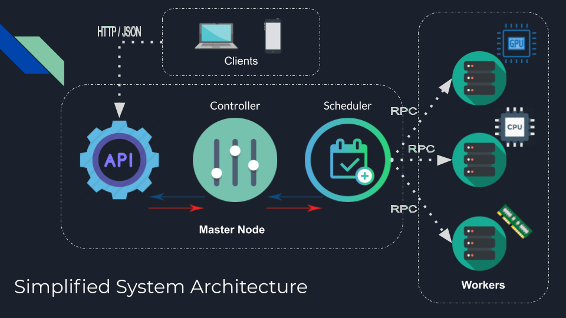

Distributed and Parallel Image Processing
==============================

This project implements a Distributed and Parallel Image Processing usgin a REST API for access control.

The cloud architecture is publisher-subscribe. Worker Nodes connect to Master Node and subscribe to start receiving jobs in the queue.

