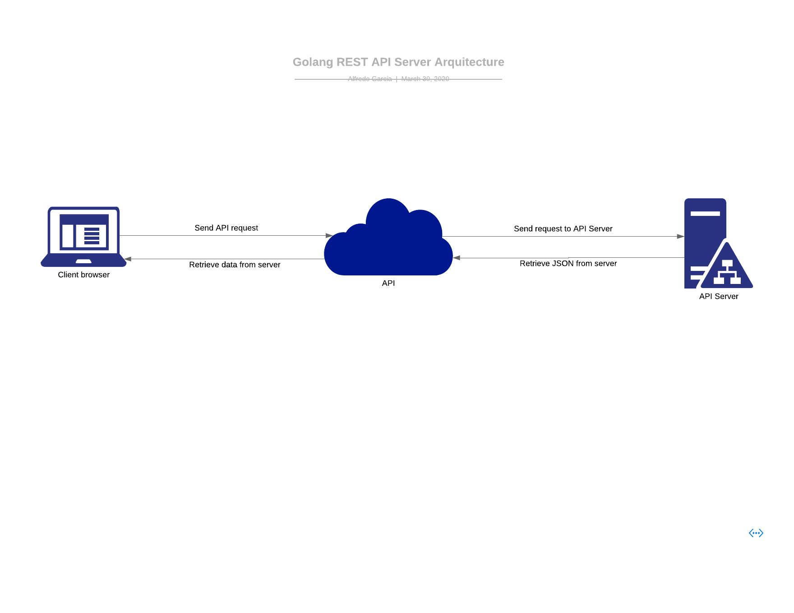

<<<<<<< HEAD
Architecture
===============================

###Arquitectura API

La arquitectura de la API consiste en un servidor que recibe peticiones en formato JSON. Este las procesa y las devuelve a los clientes.

- Cuenta con 4 funciones básicas:
  - `/Login` - Recibe el usuario y contraseña en el cuerpo del JSON y regresa un token de acceso.
  - `/Logout` - Recibe el token generado del usuario y lo elimina de la lista de usuarios con acceso.
  - `/Upload` - Recibe una imagen enviada por el cliente y regresa el nombre, tamaño y hora a la que fue enviada.
  - `/Status` - Regresa los usuarios logueados en el servidor.
=======
Architecture Document
=====================
>>>>>>> 667aef6b906eaaffe54094a098f3efff4f875b0f
