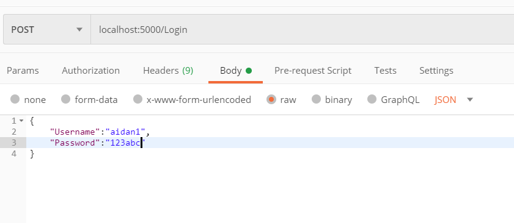
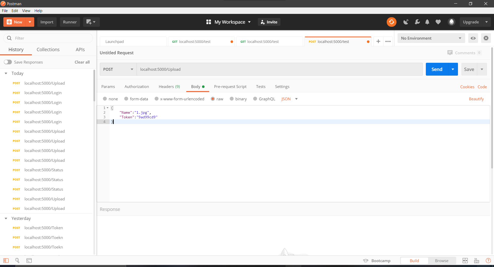

Guía de usuario
===============================

- *Prerrequisitos*
  - •	Instalar el framwork que usamos con el comando go get -u github.com/gorilla/mux ([Gorilla Mux](https://github.com/gorilla/mux))

###Uso
Ejecutar el servidor con el comando ```go run main.go```. Este se ejecuta en el purto 5000.

###Ejemplos de comandos
Todos los comandos deben ser enviados en formato JSON en el body. Utilizamos Postman para mandar las peticiones. Las respuestas son en formato JSON.
```
localhost:5000/Login
{
	"Username":"aidan1",
	"Password": "123abc"
}
```
Logout no necesita body.
```
localhost:5000/Logout
```
La imagen que se quiere subir tiene que estar previamente en el mismo directorio que el código fuente del archivo main.go. La API acepta imágenes PNG y JPG.
```
localhost:5000/Upload
{
	"Name":"nombre_de_la_imagen.jpg",
	"Token": "Ejemplo_de_token"
}
```
```
localhost:5000/Status
{
	"Token": "Ejemplo_de_token"
}
```
###Ejemplos de Postman


